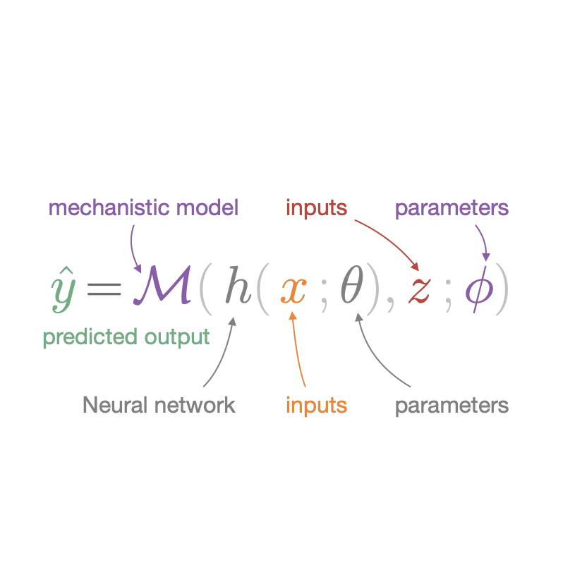

# EasyHybrid.jl
</img>
[](https://earthyscience.github.io/EasyHybrid.jl/dev/)
[](https://github.com/EarthyScience/EasyHybrid.jl/actions/workflows/CI.yml)
[](https://github.com/EarthyScience/EasyHybrid.jl/blob/main/LICENSE)


> [!CAUTION]
> Work in progress

`EasyHybrid.jl` provides a simple and flexible framework for hybrid modeling, enabling the integration of neural networks with mechanistic (physics-based) models. This approach can be expressed as:

$$
\hat{y} = \mathcal{M}(h(x;\theta), z; \phi)
$$

where $\hat{y}$ denotes the predicted output of the hybrid model, $h(x;\theta)$ is a neural network with inputs $x$ and learnable parameters $\theta$, $z$ denotes additional inputs passed directly to the mechanistic model $\mathcal{M}(\cdot, z;\, \phi)$, which is parameterized by $\phi$. The parameters $\phi$ may be known from first principles or learned from data.


## Installation
Clone the repository

```sh
git clone https://github.com/EarthyScience/EasyHybrid.jl.git
```

and start using it by opening one of the `env` in `projects`, i.e. Q10.jl. There executing the first 4 lines should get you all needed dependencies. `shift + enter`.

### If you want to start adding new functionality then do

```sh
EasyHybrid $ julia # call julia in the EasyHybrid directory
```

```sh
julia> ] # ']' should be pressed, this is the pkg mode
```

```sh
pkg > activate . # activate this project
```

### install dependencies

```sh
pkg > instantiate
```

and now you are good to go!

```julia
using EasyHybrid
```

## Quick Start Example

Here's a complete example demonstrating how to use EasyHybrid to create a hybrid model for ecosystem respiration. This example demonstrates the key concepts of EasyHybrid:

1. **Process-based Model**: The `RbQ10` function represents a classical Q10 model for respiration with base respiration `rb` and `Q10` which describes the factor by respiration is increased for a 10 K change in temperature
2. **Neural Network**: Learns to predict the basal respiration parameter `rb` from environmental conditions
3. **Hybrid Integration**: Combines the neural network predictions with the process-based model to produce final outputs
4. **Parameter Learning**: Some parameters (like `Q10`) can be learned globally, while others (like `rb`) are predicted per sample

The framework automatically handles the integration between neural networks and mechanistic models, making it easy to leverage both data-driven learning and domain knowledge.


### 1. Setup and Data Loading

```julia
using EasyHybrid

# Load synthetic dataset
ds = load_timeseries_netcdf("https://github.com/bask0/q10hybrid/raw/master/data/Synthetic4BookChap.nc")
ds = ds[1:20000, :]  # Use subset for faster execution
```

### 2. Define the Process-based Model

```julia
# RbQ10 model: Respiration model with Q10 temperature sensitivity
function RbQ10(;ta, Q10, rb, tref = 15.0f0)
    reco = rb .* Q10 .^ (0.1f0 .* (ta .- tref))
    return (; reco, Q10, rb)
end
```

### 3. Configure Model Parameters

```julia
# Parameter specification: (default, lower_bound, upper_bound)
parameters = (
    rb  = (3.0f0, 0.0f0, 13.0f0),  # Basal respiration [μmol/m²/s]
    Q10 = (2.0f0, 1.0f0, 4.0f0),   # Temperature sensitivity - describes factor by which respiration is increased for 10 K increase in temperature [-]
)
```

### 4. Construct the Hybrid Model

```julia
# Define input variables
forcing = [:ta]                    # Forcing variables (temperature)
predictors = [:sw_pot, :dsw_pot]   # Predictor variables (solar radiation)
target = [:reco]                   # Target variable (respiration)

# Parameter classification
global_param_names = [:Q10]        # Global parameters (same for all samples)
neural_param_names = [:rb]         # Neural network predicted parameters

# Construct hybrid model
hybrid_model = constructHybridModel(
    predictors,              # Input features
    forcing,                 # Forcing variables
    target,                  # Target variables
    RbQ10,                  # Process-based model function
    parameters,              # Parameter definitions
    neural_param_names,      # NN-predicted parameters
    global_param_names,      # Global parameters
    hidden_layers = [16, 16], # Neural network architecture
    activation = swish,      # Activation function
    scale_nn_outputs = true, # Scale neural network outputs
    input_batchnorm = true   # Apply batch normalization to inputs
)
```

### 5. Train the model
```julia
using WGLMakie # to see an interactive and automatically updated train_board figure
out = train(
    hybrid_model, 
    ds, 
    (); 
    nepochs = 100,           # Number of training epochs
    batchsize = 512,         # Batch size for training
    opt = RMSProp(0.001),   # Optimizer and learning rate
    monitor_names = [:rb, :Q10], # Parameters to monitor during training
    yscale = identity,       # Scaling for outputs
    patience = 30            # Early stopping patience
)

# Check results
out.train_diffs.Q10
```

## More Examples

Check out the `projects/` directory for additional examples and use cases. Each project demonstrates different aspects of hybrid modeling with EasyHybrid.
